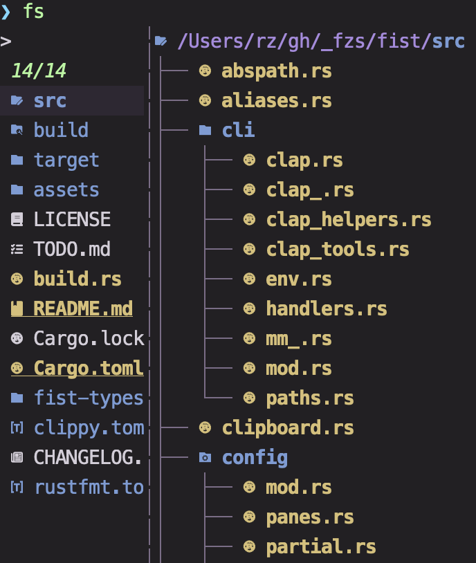
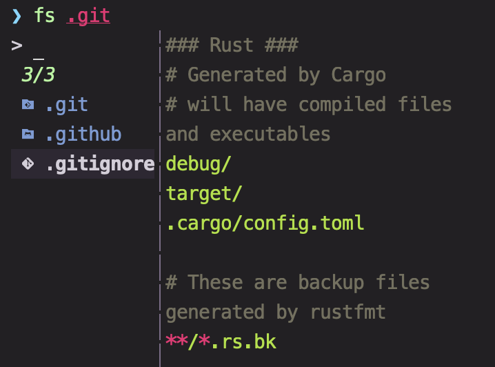
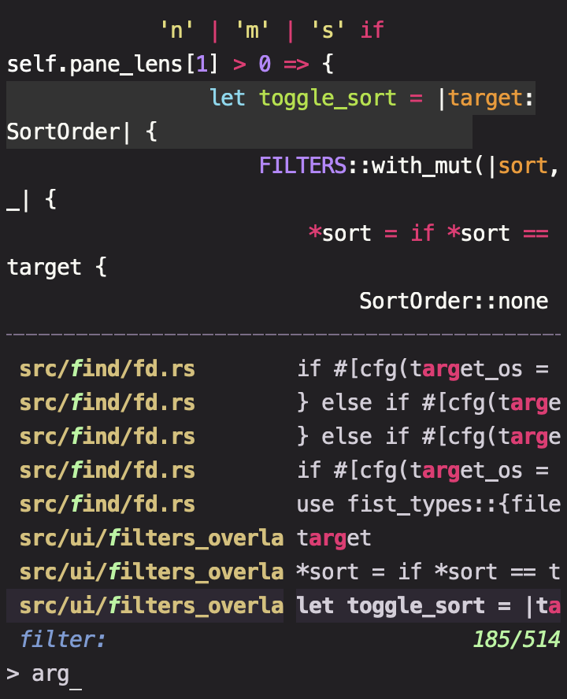
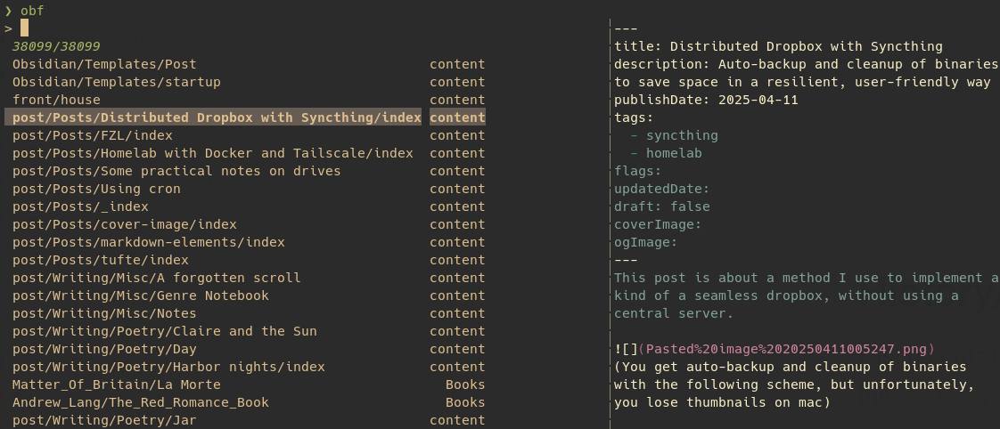
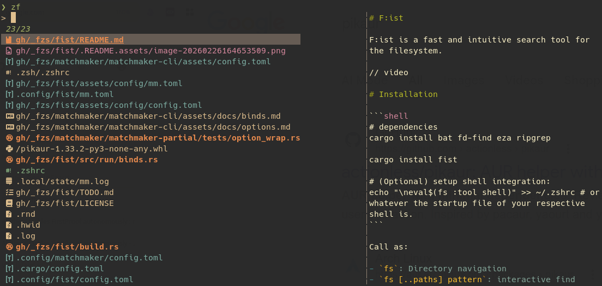

# F:ist

F:ist is a fast and intuitive search tool for the filesystem.

// video

# Installation

```shell
# dependencies
cargo install bat fd-find eza ripgrep

cargo install fist

# (Optional) setup shell integration:
echo "\neval$(fs :tool shell)" >> ~/.zshrc # or whatever the startup file of your respective shell is.
```

Call as:

- `fs`: Directory navigation
- `fs [..paths] pattern`: interactive find
- `generate_paths | fs`: enriched fuzzy searching of paths
- `z [query]`: directory jump (requires [shell integration](#shell-integration))

# Commands

### (Default) bindings overview

- `Up`/`Down`: Navigate (or `Up` in the initial position to to enter prompt).
- `Left`/`Right`: Back/Enter.
- `Enter`: Default (system) open.
  - `Alt-Enter`: Print / Alternate open.
  - `Ctrl-Enter`: Open in background.
  - `alt-b`: Edit folder

---

- `ctrl-f`/`ctrl-r`: Find files / Search text.
- `ctrl-g`: History view (Folders and files).
- `ctrl-z`/`ctrl-y`: Undo / Redo.

---

- `ctrl-x`/`ctrl-c`/`ctrl-v`: Cut, Copy, Paste.
- `delete/shift-delete`: Trash/Delete.
- `ctrl-e`: Open menu.
- `ctrl-t`: Open stash.
- `ctrl-i` : Open filters.

- `ctrl-s`/`alt-h`: Toggle hidden.
- `ctrl-d`: Toggle contextual visibility.

---

- `Tab`: Toggle select.
- `alt-enter`: Print.
- `?`: toggle preview.
- `ctrl-l`: Full preview.
- `alt-l`: Extended preview.
- `/` and `~`: Jump to home

For a full list of binds within the app, type `ctrl-shift-h`.\
For more information on bindings, see [matchmaker](https://github.com/Squirreljetpack/matchmaker).

# Panes

## Nav

Start by calling `fs` without any positional arguments.



## Find

Start by calling `fs` with arguments, or by using the subcommand: `fs :: [OPTIONS] [PATHS]... [PATTERN]`.

Searches all sub-files and directories. Filtering and sort order can be configured on the command line.



## Search

Start by calling `fs` with the subcommand: `fs : [OPTIONS] [PATHS]... [PATTERN]`.

The results are displayed in two columns: the main filepath column, and a secondary context column displayed after it. In this pane, the context column contains the query matches (and any requested context lines around them).

This pane operates in two modes which can be switched between with `ctrl-r`[^1], a query and a filter mode.

- In query mode, the results are populated with all text matches of a given query (your input).
- In filter mode, the results are filtered to lines matching your input.
- By default, the filter applies to the main (first) column. To switch to filtering the second column, type `%` (i.e. `path_filter % context_filter`)
- The currently active query/filter of the inactive mode is displayed above your input[^2].

For more information, see `fs : --help`.



[^1]: The same key used to enter this pane
[^2]: the mistake in the image has been fixed

## Stream/Custom

f:ist can also accept arbitrary lists of files from a command or input stream, where all the usual operations are available:

- directory traversal
- file create/edit/delete/custom actions relative to the current item/directory.
- enriched display
- full text search
- reversible actions
- preview
- filtering and sorting
- and so on.

The following is an example script for managing directories of markdown notes:

```zsh
### --- ob._open -- ###

#!/bin/zsh

# This first command demonstrates the use of fs as a wrapper for fd,
# by use of the `--list` and `--` parameters:
# `--list` (available for all panes), starts fs non-interactively,
# while arguments after `--` passed through to `fd`.
# The effect however, is simply to list all folders in a given folder.
fs -t d --list $OBSIDIAN_HOME . -- --max-depth 1 |
while read -r line; do
  # This command finds all markdown files, and prints them in a custom format:
  # {a:b} is a slicing syntax for path components
  # {-1:} means take the last component
  # 3 different delimiters are supported for slicing: , `=`, `.`
  # `:` target the single-quoted current item
  # `=` target the current item without single quotes
  # `=` target the current working directory without single quotes
  #
  # --no-read is needed because fs tries to read from stdin if it detects incoming input
  FS_OUTPUT="{=}\t{-1.}" fs -t .md --list --no-read $line .
done |
# opener: use this program to open the selected file
# delim: use this delimiter to split the input into a Path and a Context
# display: run this script to determine how the input item is rendered given its Path and Context.
FS_OPTS="opener=ob._open display='echo \${\${1#*/\$2/}%.md}' delim=\t" fs

# Note:
# For better performance, you should use in the last command instead of display=:
# display-batch='while ((\$#)); do echo \${\${1#*/\$2/}%.md}; shift 2; done'
# which should be a script that consumes a batch of PathItems,
# each of which correspond to 2 input arguments: the Path and the Context,
# and outputs the desired display representation in order.

```

```shell
### --- ob._open -- ###

# This script takes a filepath, and opens it with Obsidian.
# We pass the uri to fs :o so that it records it in our history, which we can later access using `fs :file`.

uri() {
  print -nl $@ | sed 's/ /%20/g; s/\//%2F/g'
  # or more reliably, print -nl $@ | jq -sRr @uri
}
fs :o "obsidian://open?path=$(uri $1)"
```



## History/App

f:ist records the files, directories and applications that you've visited in a local database, where they are displayed in the `Files`, `Folders` and `Apps` panes, sorted by relevance[^3].



[^3]: frequency, recency, and similarity to query.

# Tools

### Shell integration

Only zsh is supported for now.

The output of `fs :tool shell`, when sourced, provides the jump and jump+open functions:

The jump function (`z`) is a replacement for `cd`, except that incomplete queries are matched to a most likely destination drawn from the unified f:ist database.

> [!NOTE]
>
> In addition, a couple special queries can be used to start an interactive search. Ultimately, the full behavior[^2] is as follows:
>
> the only argument is a valid path: `cd`.
> no arguments: interactively select from history.
> last argument is `.` : interactively search subdirectories of the best match.
> otherwise: cd into the best match[^1] for the search term (if one exists).

[^1]: See: [zoxide](https://github.com/ajeetdsouza/zoxide)

[^2]: There is one final case: if the last argument is `./`: z interactively navigates the best match. If you have [aliases](#aliases) enabled, this is also just `Z`.

The jump+open function (`zz`) is an analogous replacement for [`lessfilter edit`](#lessfilter): if the query head exists, it opens the target(s) in the editor. Otherwise the query is passed to `z`, and the editor opens in the destination.

##### Additional

The `--aliases` flag can be enabled to additionally output a few simple alias definitions:

- [lessfilter](#lessfilter)
- lz: directory display
- l: lessfilter (display preset)
- la: lessfilter (extended preset)
- ll: lessfilter (info preset)
- n: edit (lessfilter with edit preset)
- o: [open](#app)
- Z: `z`, then navigate
  - In case your shell doesn't support uppercase function names, the name can be set like so: `fs :tool shell --aliases --shell csh --nav-name x`.
- `zf`: recent files history

For speed and safety, it is recommended pass your actual shell through to `--shell`.[^4] Another optimization you can make is to cache the generated command: my [zcomet fork](#https://github.com/Squirreljetpack/zcomet) supports this.

### Lessfilter

The previewer is controlled by the lessfilter tool.

The lessfilter tool dispatches to 10 presets:

- preview: For the preview pane
- display: For terminal display
- extended: For terminal interaction/verbose display
- info: Metadata/raw info
- extract: extract document contents with [kreuzberg](#https://github.com/kreuzberg-dev)
- open: System open
- alternate: Alternate (custom) open
- edit: For editing

Each preset is configured by a rules table; each rule is a pair (Actions, Patterns); and for a given file, the rule whose patterns score the highest is selected -- its actions are invoked on the target file.

The patterns can be prefixed with a score modifier which dictates how the score is modified by a successful match of the pattern - if this is omitted, the default score modifier for the pattern is used.

The score modifiers are:

- Add/Sub (n): Add/Sub (n) to the current score.
- Max/Min (n): Take the max/min of the current score with (n) for the new score.
- Req: Set the score to 0 if the test fails.

The patterns are:

- Glob: (default score: `Max(100)`)
- Child: (default score: `Max(50)`)
- Mime: (default score: `Max(20)`)
- Cat: (default score: `Max(20)`)
- Ext: (default score: `Max(10)`)
- Have: (default score: `Req`)
- Filetype: (default score: `Req`)

Though the syntax has many parts, configuration should be fairly straightforward. F:ist comes with a sane set of defaults with wide coverage for a variety of filetypes, and declaring overrides is as simple as declaring the desired action together with the conditions which it requires. For example:

```toml
### --- lessfilter.toml -- ###

preview = [
  # ...
  # On an file with mime-type sqlite-3 and a system with sqlite3, this rule gets a score of 20.
  [ [ "sqlite" ], [ "application/vnd.sqlite3", "have:sqlite3" ] ],
  # ...
]

# When invoking the edit action (in `fist` or through the `n` alias),
# any file belonging to this category will be opened with the system's default preferred application.
# Note that since this rule has minimal priority (at most 1), any subsequent rule will override it.
edit = [
  [ [ "Open" ], [ "1|cat:document", "1|cat:spreadsheet", "1|cat:email", "1|cat:academic" ] ],
]
```

The built-in actions are:

- Text
- Image
- Metadata
- Directory
- Header
- None
- Open

Additional actions can be defined with shell syntax. For example:

```toml
[rules]
alternate = [
  [["code"], ["*/*"]],
]
[actions]
code = 'code --add {}'
```

###### Addditional notes

- Image display requires [chafa](https://github.com/hpjansson/chafa).
- document preview (i.e. pdf) requires [kreuzberg](#https://github.com/kreuzberg-dev)

# Additional

### Dependencies

- fd-find
- ripgrep
- bat (preview)
- eza (optional: preview)
- chafa (optional: preview)
- kreuzberg (optional: preview)
- mediainfo (optional: preview)

Conversely, fist integrates into [CommandSpace](https://github.com/Squirreljetpack/command-space), which you may also enjoy checking out.

### Notes

- The `New` action creates a directory if the target ends with a path seperator[4].

- The process which runs the command that spawns programs can be relegated to a process manager. For example, using [pueue](https://github.com/Nukesor/pueue):

```toml
# config.toml

[misc]
spawn_with = ["pueue", "add", "-g", "apps", "--"]
```

[^4]: `/` on unix and `\` on windows

# Configuration

### Notes

- Variant values such as `RetryStrat` or `SortOrder` should be given in CamelCase.
