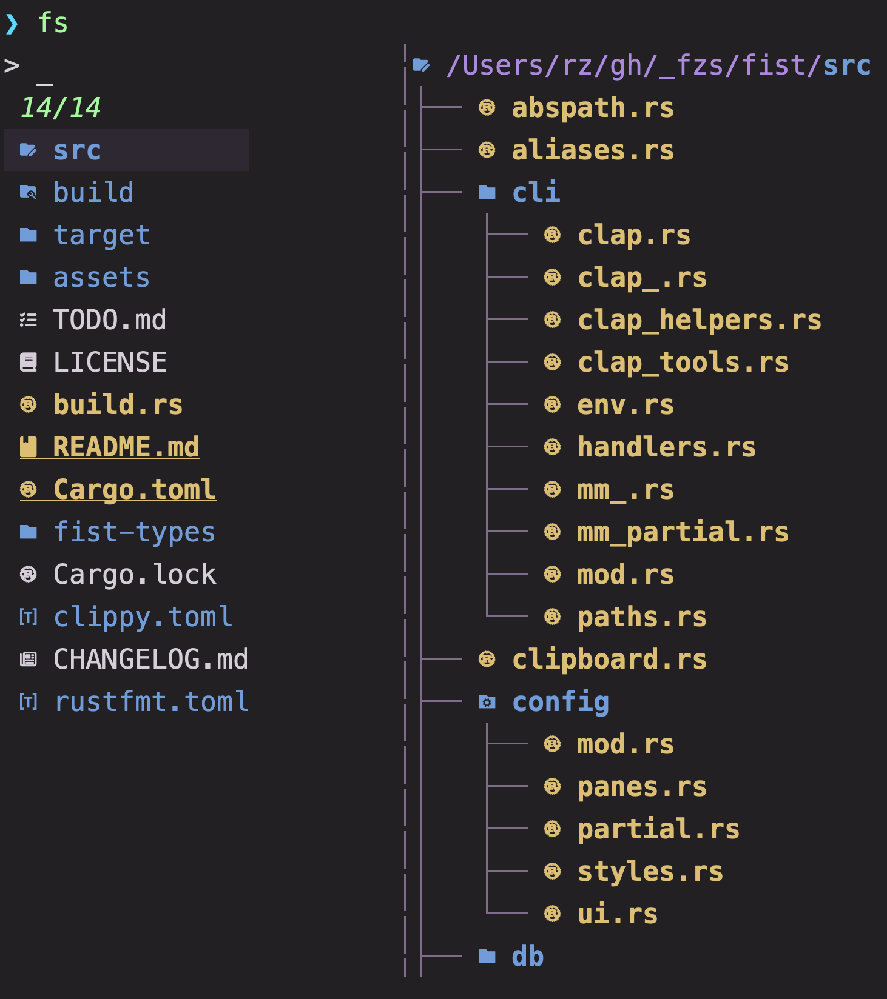
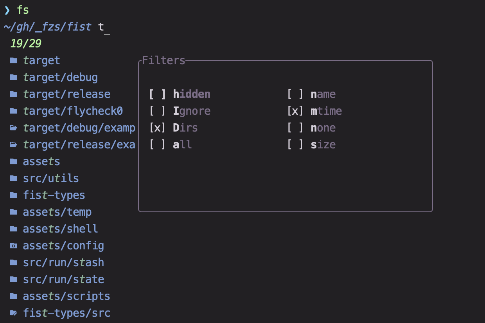
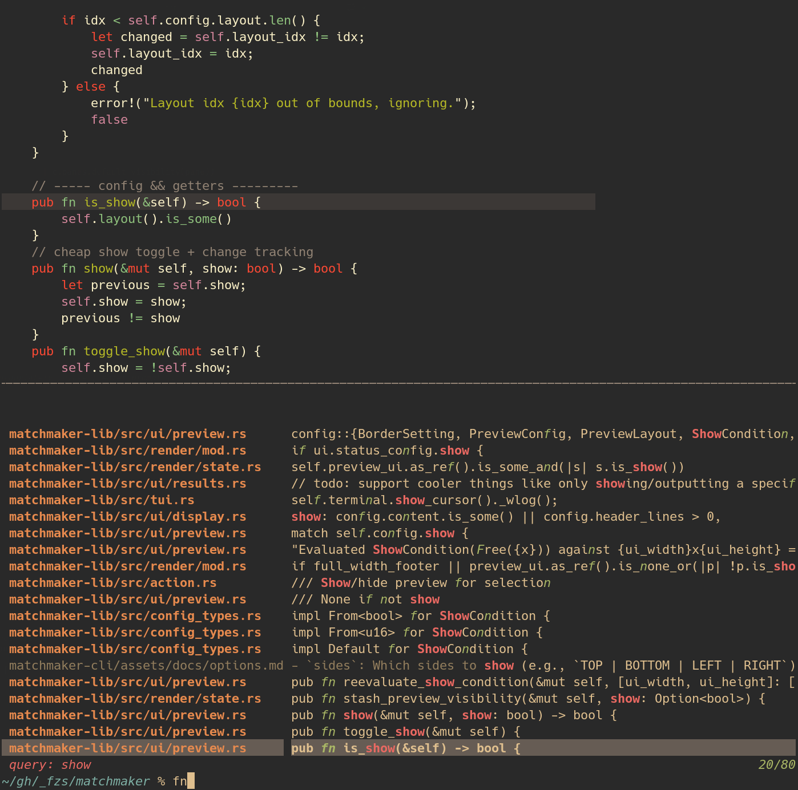
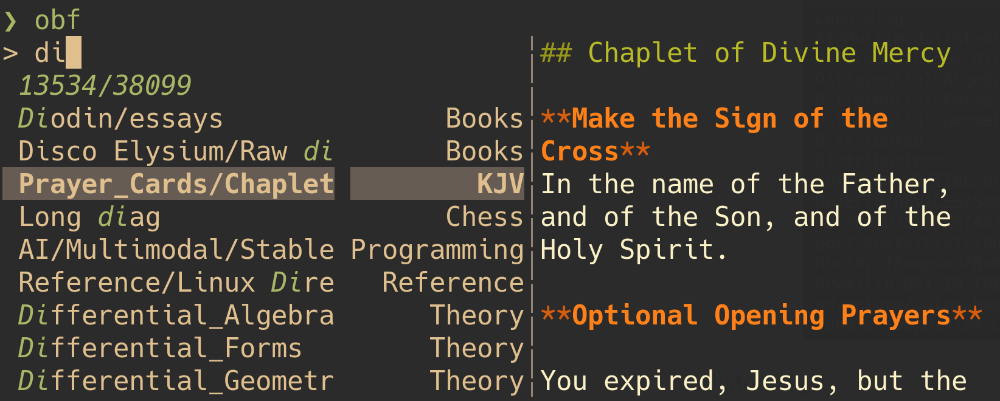
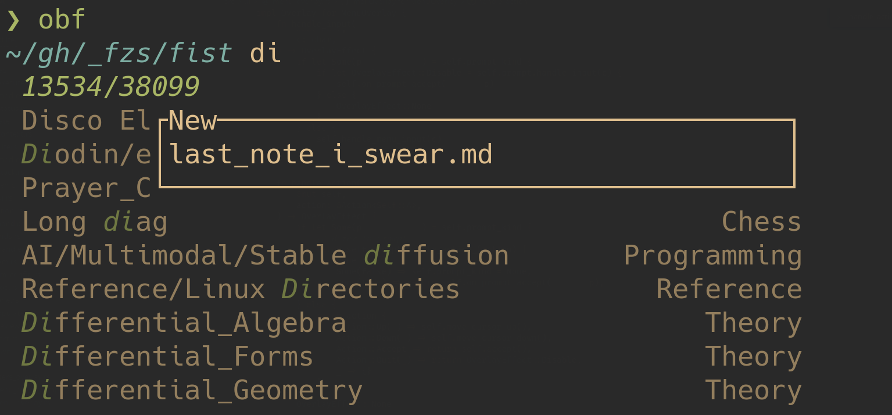
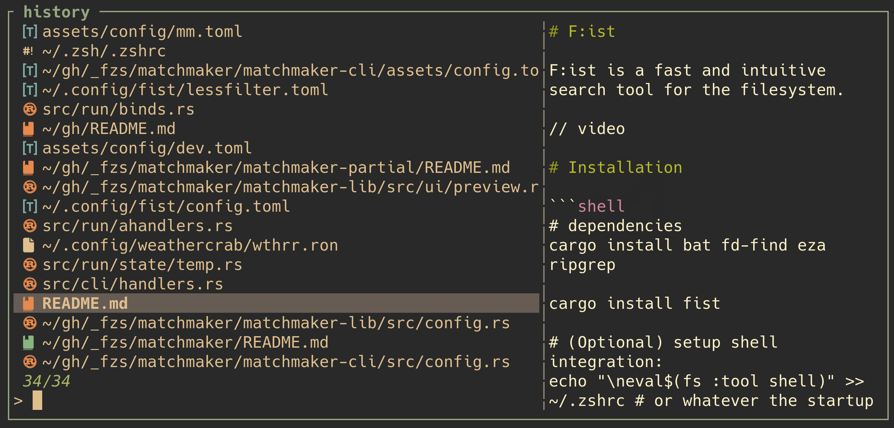
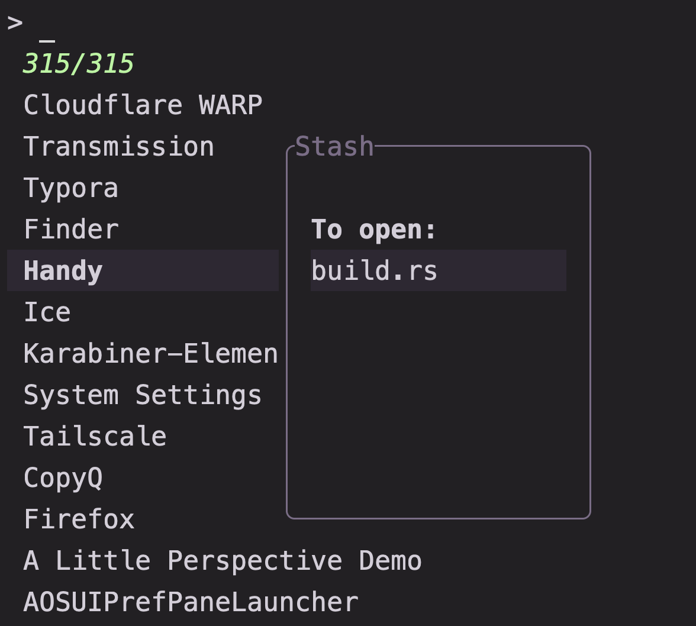
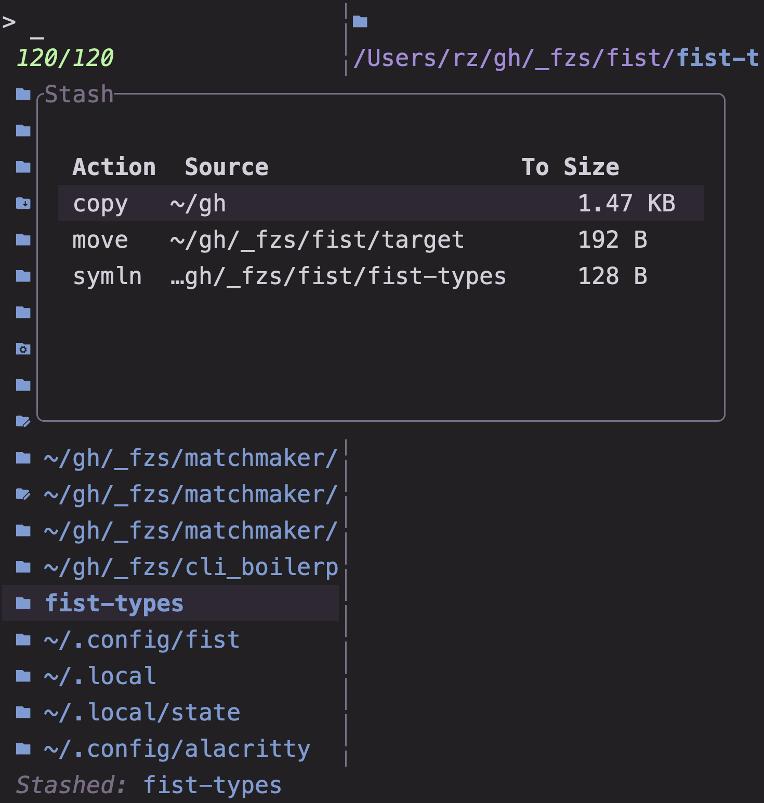
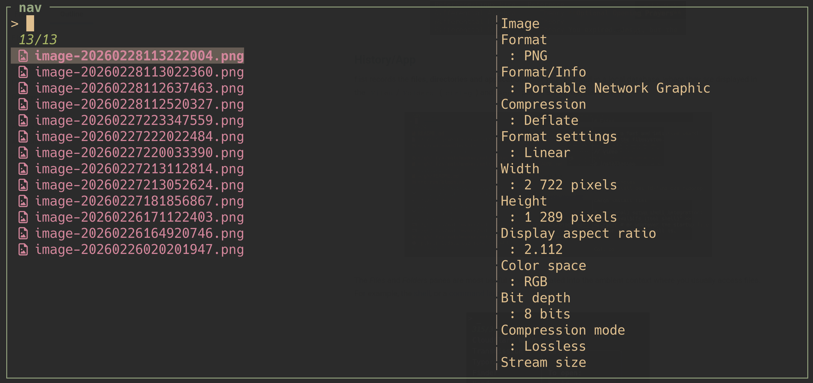

# F:ist

F:ist is a fast and intuitive search tool for the filesystem.

// video

> *Skeptic: What is your biggest strength?*
>
>> Speed, simplicity, power, capability, extensibility, customizability, adaptability, minimalism, flexibility, utility, efficiency, versatility, robustness, reliability, precision, clarity, elegance, performance, responsiveness, portability, composability, modularity, interoperability, scalability, maintainability, resilience, configurability, programmability, expressiveness, concision, practicality, pragmatism, openness, autonomy, control, freedom, agency, coherence, consistency, usability, intuitiveness, observability.
>>
>> <p align="right">— <b>f:ist</b></p>

> [!WARNING]
>
> The README is currently a little outdated, but the essentials are covered, and it should be enough to start with, all you really need beyond it is the 'alt-h' key to show the bindings help.

# Installation

Install the required dependencies:

```shell
cargo install fd-find ripgrep
# (optional)
cargo install bat eza chafa kreuzberg mediainfo
```

Get the binary with the install script (or choose one of the options below)

```sh
curl -fsSL https://raw.githubusercontent.com/Squirreljetpack/fist/main/install.sh | sh
```

```powershell
powershell -ExecutionPolicy Bypass -c "irm https://github.com/Squirreljetpack/fist/releases/latest/download/fist-installer.ps1 | iex"
```

Optionally, setup shell integration:

##### Zsh / Bash / POSIX

```sh
eval "$(fs :tool shell)"
```

##### Fish

```fish
fs :tool shell --shell=fish | source
```

##### Nushell

```nushell
# 1. Generate the script once in your terminal:
fs :tool shell --shell=nu | save -f ~/.config/nushell/fist.nu

# 2. Add to your config.nu ($nu.config-path):
source ~/.config/nushell/fist.nu
```

Call as:

- `fs`: Directory navigation
- `fs [..paths] pattern`: interactive find
- `generate_paths | fs :custom`: enriched fuzzy searching of paths
- `z [query]`: directory jump (requires [shell integration](#shell-integration))

Finally, when you're ready, initialize the configuration files, and try out the new (!) [bundled menu actions](#menu).

```sh
fs --dump-config
```

---

##### Homebrew

```sh
brew install Squirreljetpack/tap/fist
```

##### AUR

Not available

##### npm

```sh
npm install -g @squirreljetpack/fist
```

##### Cargo

```sh
cargo install fist
```

# Commands

### Bindings overview

- `Up`/`Down`: Navigate (or `Up` in the initial position to to enter prompt).
- `Left`/`Right`: Back/Enter.
- `Enter`: Default (system) open.
  - `Alt-Enter`: Print / Alternate open.
  - `Ctrl-Enter`: Open in background.
  - `alt-n`: Open folder in editor.

---

- `ctrl-f`/`ctrl-r`: Find files / Search text.
- `ctrl-g`: History view (Folders and files).
- `ctrl-z`/`ctrl-y`: Undo / Redo.

---

- `ctrl-x`/`ctrl-c`/`ctrl-v`: Move, Copy, Paste.
- `delete/shift-delete`: Trash/Delete.
- `ctrl-e`: Open menu.
- `ctrl-u`: Open queue.
- `ctrl-p` : Open options.
- `ctrl-s`/`alt-h`: Toggle hidden.
- `ctrl-d`: Toggle contextual visibility.

---

- `Tab`: Toggle select.
- `alt-enter`: Print.
- `?`: toggle preview.
- `alt-/`: toggle [informative](#lessfilter) preview.
- `ctrl-l`: Maximize preview.
- `alt-l`: Maximize [extended](#lessfilter) preview.
- `/` and `~`: Jump to home
- `ctrl-[1-9]`: Autojump to item
- `ctrl-0`: Autojump to prompt

For a full list of binds, press `alt-h` within the app[^binds].

[^binds]: For more information on bindings (how they are defined, key testing, and default generic binds), see [matchmaker](https://github.com/Squirreljetpack/matchmaker).

# Panes

### Nav

To begin, call `fs` without any positional arguments.



Once inside, you can navigate and re-enter from other panes by pressing the `left`/`right` arrow keys (corresponding to the `Parent`/ `Advance` actions).

#### Prompt locking

F:st binds `left`/`right` to actions to emulate a traditional file manager experience and to keep all the (most useful) navigation keys together. However, it has its downsides: as the prompt is also available for typing, the `ForwardChar`/`BackwardChar` actions by necessity have to be rebound to `shift-left`/`right`, and this can be a bit unexpected at first. To prevent accidents in query-reliant panes like [`Find`](#Find) or [`Search`](#Search), the pane enters a `locked` state for these: this is visible by the appearance of a blue border around your prompt. When the prompt is locked, the `Parent` and `BackwardChar` actions switch roles, and likewise for `Advance` and `ForwardChar`. The `Accept` action is also intercepted, focusing you on the pane directory, or accepting it if already focused. On macos, the default `cmd+delete` is also restricted to `DeleteWord` instead of the conventional `Trash` action.

The locked state can also be entered by *entering the prompt* -- pressing up at the first result, (or down at the last with `results.cycle`). Note that `in_prompt` ⇒ `locked_prompt`: in this state, the prompt displays your current directory, and all actions apply to that instead. To exit the prompt, just press up or down again. To exit *the locked state*, there is also the default bind `alt-space`[^prompt-lock] -- but this is usually unnecessary as you can just press `shift-left`/`right` to recover the `Parent`/`Advance` actions.

Unfortunately, this is by far the least straightforward feature of F:st. Hopefully, it will make more sense when you start to use it. If it doesn't, you can always set `interface.prompt_locking` to false to make your arrow keys always do "the same thing". In fact, rather more is true: every aspect of the above described behavior can be adjusted to your preference through configuration. This is one of the guiding heuristics of the project: it seeks to provide the best out-of-the-box experience through opiniated defaults, but full power should always remain with the user: beneath the polished surface, everything is customizable or extensible.

### Find

You can search through all files recursively by

- using the subcommand: `fs :: [OPTIONS] [PATHS]... [PATTERN]`
- by calling `fs` directly with the same arguments
- or by triggering the `Find` action (`ctrl-f`) in-app.



The results will be available for filtering, navigating, editing, previewing etc. Filtering and sort order can be adjusted through the [Options overlay](#options).

> [!NOTE]
>
> f:ist uses fd for this internally, and that search parameters can be passed through directly following `--`. However, it is not a strict wrapper and several differences in behavior in the command specification exist:
>
> - The last positional argument is treated as the query instead of the first
> - queries beginning with `.` auto-enables the inclusion of hidden files
> - Default parameters, directory-specific ignores, and other parameters can be set in the [config](./src/config/mod.rs#L257).
> - The `-t` (type) flag has be overloaded to support more conditions. In addition to file types (`directory/d, symlink/l, ..etc.` ), it now supports extensions (`-t .ext`), pre-set categories (`image/i, video/v`), and custom categories as well.

### Search

You can perform a full text search

- using the subcommand: `fs : [OPTIONS] [PATTERNS]... [-- <RG_ARGS>...]`
- or by triggering the `Search` action (`ctrl-r`) in-app.

In f:ist, each result supports two columns: the main filepath column, and a secondary context column[^columns].

In this pane, the context column contains the query matches (and any requested context lines around them).

This pane operates in a query and a filter mode, which can be switched between[^mode-switch]:

- In *query mode*, the results are (dynamically) populated with all text matches of a given query (your input).
- In *filter mode*, the results are filtered to only lines matching your input.
- By default, the filter applies to the main (first) column. To switch to filtering the second column, type `%` (i.e. `path_filter % context_filter`)
- The current query/filter of the inactive mode is displayed above your input.
- In query mode, multiple queries (of which any should match) are seperated by whitespace. Queries containing whitespace can be grouped together by single quotes. Single quotes can be escaped as `\'`.
- The default mode treats the given queries as *regexes* (as opposed to the filter input, which does not). This can be toggled, or the default [reconfigured](#configuration).

> [!NOTE]
>
> When the active item is `advance`/`executed` on, the matched line and column are saved in the environment variables `HIGHLIGHT_LINE` and `HIGHLIGHT_COLUMN`. If your system has a compatible editor, the `Lessfilter::Edit` action can automatically open the file to the corresponding position -- otherwise, you can configure this manually.



### Stream/Custom

f:ist can also accept **arbitrary lists of files from a command** or **input stream** through the `:custom` subcommand (`fs :custom [CMD]...`, where an empty command reads from stdin), where all the usual operations are available:

- directory traversal
- file create/edit/delete/custom actions relative to the current item/directory.
- enriched display
- full text search
- reversible actions
- preview
- filtering and sorting
- and so on.

A complete example of a notes manager this can be used for can be found [here](https://squirreljetpack.github.io/fist-docs/custom-pane#example-browsing-markdown-notes).

 

### History

f:ist records the **files, directories and applications** that you've visited in a local database, where they are displayed in the `Files`/`Folders` (`ctrl-g`) and `Apps` panes, sorted by relevance[^relevance].



The *Files* and *Folders* panes are most useful when integrated into the ambient context where you usually access files. For example, the [shell](#shell-integration), or a [command launcher](#dependencies).

### Named stashes

`PushStash(name)` adds the selection (or the current directory while the cursor is disabled) to a named stash, and `OpenStash(name)` switches to its pane. Stash panes are transient or database-backed collections of paths, useful for scratch space or bookmarking[^stashes].

> [!NOTE]
>
> Combined with contextual [Menu actions](#menu) and the (default) transient pane (`alt-s`/`alt-shift-s`), they are f:st's answer to all cross-directory workflows, such as comparing files and folders, archiving, or bulk-renaming.
>
> Note that simple actions like Copy and Paste don't require a stash, simply [jump](#history) to your source files to queue them up, jump (or [undo](#additional-notes) if you came from there) to your destination, and [paste](#queue).

### App

The apps pane comes prepopulated from the existing applications on your system, and can be accessed either through

- `fs :o -w [..FILES]` on the command-line
- the `open with` [menu action](#menu)
- a custom binding for the `App` action.

The `App` action has no default key binding. `fs :o --list` prints the
currently known application paths without opening the app pane.



It can be used to select a launch method for a given set of files (provided through the command line, or collected in the app view's pending files).

### Options

Every pane has a **Options overlay** (`ctrl-p`), with settings for [filtering](https://squirreljetpack.github.io/fist-docs/visibility), [sorting](https://squirreljetpack.github.io/fist-docs/sorting), and other pane-specific controls for the displayed results.


Selecting a sort does not interrupt the current results; items are resorted on the fly. The active sort key is displayed on the right.

Panes can also configure a default sort. This applies a soft sort to the results: the ordering reflects a combination of query relevance and the sort order. The sort key is not displayed when soft sorting is active. In the `Files/Folders/Apps/Search` panes, sorting is always soft: the initial ordering is still faithful to the sort key.

### Additional notes

Panes can be navigated between using the `Undo/Redo` actions.

For more information on any of the panes, run `fs [pane] --help` with the appropriate subcommand (i.e. `:rg`).

[^prompt-lock]: necessarily, this will also drop you out of the prompt if you were in it

[^columns]: In the previous panes, the secondary column was simply empty and therefore not displayed.

[^mode-switch]: via the same action.

[^relevance]: frequency, recency, and similarity to query.

[^stashes]: I had considered also adding filesystem-backed paths for some kind of backup or templating functionality, but came to the conclusion that this is a purpose better suited to a custom [Menu action](#menu), or more simply, done by binding to something like [`Copy`, `Paste(dest)`] + `Jump(dest)`.

# Actions

### Menu

The **Menu** (`ctrl-e`) houses all the actions available in the current context.

Custom actions can be added in `actions.toml` and from files in `actions/`. They consist of 3 parts:

- **Action**: The script to execute.
- **Conditions**: The various conditions which must be satisfied to show this action in the menu.
- **Execution**: Parameters controlling how the action is executed.

You can find a couple official actions [here](https://github.com/Squirreljetpack/fist/tree/main/assets/actions), providing contextual actions for compression and comparison (of files/folders).

For more information, consult the [docs](https://squirreljetpack.github.io/fist-docs/menu-actions).

### Binds

The other, more direct way to add arbitrary execution flows is by adding `Execute`-type actions in the `[binds]` section. These work the same way as binds from [matchmaker](https://github.com/Squirreljetpack/matchmaker) or [fzf](https://github.com/junegunn/fzf).

For example, the default `mm.toml` binds `Ctrl-Esc` to `Execute($SHELL)`: the inner string is executed in your shell environment, allowing you to drop into a shell from your current directory in f:st. On exit, you return to the main app. There are also additional variants such as `ExecPaged`, which lets you view your results in a navigable interface, or `Become` -- which transforms the process into the script provided instead of pausing f:st.

### Queue



The **Queue** overlay (`ctrl-u`) lists the pending file operations. Rows show their kind, source, destination, and progress, and can be edited, rearranged, removed and executed from the overlay. `Undo`/`Redo` cycles between filters to narrows the overlay to a single queue kind.

`Move` and `Copy` enqueue items under the `move` and `copy` kinds. `Paste` (`ctrl-v`) executes every queued `copy`, `move` and `symlink` item without enterring the overlay, transferring files into the active directory[^paste-safety]. `ExecuteQueue(selector)`, `Enqueue(kind)` and `ClearQueue(selector)` are also available for binding[^selectors].

Menu actions with the `Queue`/`QueueBatch` strategies enqueue their targets under the action's key; on execution the action's lua script runs once per queued item with `(paths, dst, nav_cwd?)`. `dst` is read from the `to` column of the overlay, and `nav_cwd` is supplied when executed from a [Nav pane](#nav).

[^paste-safety]: Although safeguards exist to keep these alive and prevent data loss during normal application execution and shutdown, if reliability is crucial it might be safer to define your own custom actions to perform, manage and monitor these actions externally. Ideas and contributions in this area are welcome!

[^selectors]: `selector` is similar to `kind`, but with the addition of the reserved strings `all` (default), `first`, `last`, and `builtins` (i.e. Paste is just `ExecuteQueue(builtins)`).

# Tools

f:ist comes with several secondary subcommands for reference and utilitary purposes. They can listed with `fs :tool`.

### Shell integration

Supports **Zsh**, **Bash** (4.3+), **Fish**, **Nushell**, and standard **POSIX** shells (`sh`, `dash`, `ash`, `ksh`).

The output of `fs :tool shell` will, when sourced, provide the jump, nav, open, and interactive line-editor widget functions:

The jump function (`z`) is a replacement for `cd`, except that incomplete queries are matched to a most likely destination drawn from the unified f:ist database. This behavior is inspired by zoxide[^zoxide].

> [!NOTE]
>
> In addition, a couple special queries can be used to start an interactive search:
>
> - the only argument is a valid path: `cd`.
> - no arguments: interactively select from history.
> - last argument is `.` : interactively search subdirectories of the best match.
> - otherwise: cd into the best match for the search term (if one exists)[^jump-nav].
>
> One final change from zoxide is the introduction of the `history.refind` setting in the [config](#configuration).
> When no match is found, or when the top result is the current directory, this setting causes the the interactive interface to be started.

The line-editor widget functions push your selected paths onto your command line. By default, `shift+left` binds to recursive directory search, `shift+right` binds to recursive file search. There is also a full-text search widget bound to `shift+down`: this one does not modify your command-line, but is useful rather because it leaves it *intact*.

To disable any function/widget, just set its bind to the empty string.

##### 

> [!NOTE]
>
> These are also fzf's default keybinds (and function similarily), so it's recommended to disable those when using f:st.
>
> Also, before adding them to your shell startup, you can also run the output directly to try them out. On POSIX shells, this is just `eval "$(fs :tool shell --myshell)"`.

#### Additional

Including the `--aliases` flag will add a few simple alias definitions into the initialization:

- [lessfilter](#lessfilter)
- `lz`: directory display
- `l`: lessfilter (display preset)
- `la`: lessfilter (extended preset)
- `ll`: lessfilter (info preset)
- `n`: edit (lessfilter with edit preset)
- `o`: [open](#app)
- `zf`: recent files history

For speed and safety, it is recommended pass your actual shell through to `--shell`[^shell-cache].

### Lessfilter

The previewer is controlled by the lessfilter tool.

The lessfilter tool dispatches to 9 presets:

- `preview`: the preview pane
- `display`: terminal display
- `extended`: terminal interaction or verbose display
- `info`: metadata and raw information
- `open`: system open
- `edit`: editing
- `alternate` and `alternate2`: extra presets for custom use



Each preset is configured by a rules table in the [config file](https://github.com/Squirreljetpack/fist/blob/main/assets/config/lessfilter.toml). Each rule is a pair (Actions, Patterns), and for a given file, the rule whose patterns score the highest is selected -- its actions are invoked on the target file.

The score modifiers and their prefix syntax are:

- `>n|pattern`: `Max(n)` — take the max of the current score with `n`.
  - The minimal syntax `n|` (such as `1|cat:...`) is also supported.
- `<n|pattern`: `Min(n)` — take the min of the current score with `n`.
- `+n|pattern`: `Add(n)` — add `n` (or 1) to the current score.
- `-n|pattern`: `Sub(n)` — subtract `n` (or 1) from the current score.
- `^|pattern` : `Req` — require the condition; sets the score to 0 if the test fails.
  - `^pattern` is also supported.

The patterns and their default scores (used when no score prefix is specified) are:

- `glob`: match the full path — `Max(50)`
- `child`: match a child name (or a sibling name for a file) — `Max(50)`
- `ext`: match a file extension — `Max(30)`
- `mime`: match a MIME type such as `text/plain` or `image/*` — `Max(20)`
- `cat`: match a built-in or configured file category — `Max(20)`
- `application`: match a platform-specific application bundle, launcher, or executable — `Max(60)`
- `*`: match any path — `Max(0)`
- `have`: require an executable to exist — `Req`
- `filetype`: require a matching filesystem type — `Req`
- `git`: require a path inside a Git work tree — `Req`

Though the syntax has many parts, configuration should be fairly straightforward. F:ist comes with a sane set of defaults with wide coverage for a variety of filetypes, and declaring overrides is as simple as declaring the desired action together with the conditions which it requires. For example:

```toml
### --- lessfilter.toml -- ###

preview = [
    # ...
    # On an file with mime-type sqlite-3 and a system with sqlite3, this rule gets a score of 20.
    # sqlite is a custom action whose definition can be found in the default lessfilter.toml configuration file.
    [["sqlite"], ["application/vnd.sqlite3", "have:sqlite3"]],
    # ...
]

# When invoking the edit action (in `fist` or through the `n` alias),
# any file belonging to this category will be opened with the system's default preferred application.
# Since this rule has minimal priority (at most 1), any subsequent rule will override it.
edit = [
    [
        ["Open"],
        [
            "1|cat:document",
            "1|cat:spreadsheet",
            "1|cat:email",
            "1|cat:academic",
        ],
    ],
]
```

The built-in actions are:

- `Directory`
- `Application`
- `Text`
- `Image`
- `Extract`
- `Metadata`
- `Open`
- `Header`
- `None`

Additional actions can be defined via the same same shell+[templating](https://squirreljetpack.github.io/fist-docs/output-templates#the-format-template) syntax as actions under `[bind]`. For example:

```toml
[rules]
alternate = [
    [["code"], ["*/*"]],
]
[actions]
code = 'code --add {}'
```

Note that certain default previews will not display without the required [dependencies](#dependencies).

### Types

A list of all supported types, used by the `-t` parameter of the [find subcommand](#find) and the `cat` condition of the [lessfilter](#lessfilter).

### Others

fs exposes several of the more generally useful functionalities it uses internally:

- `diskspace`: A stupid fast parallel directory tree/size lister, using the same background worker that is used in the main app for sorting by size.

- `trash`: cross platform tool for easily moving files to the system trash.

- `pager`: smart compatible pager that feeds `bat` for syntax highlighting into `minus` for modern aesthetics.

- as for the rest, run `fs :tool` to see a full listing.

[^jump-nav]: There is one final case: if the last argument is `./`: z interactively navigates the best match. This is also provided directly by `x` (configurable via `--nav-name`).

[^shell-cache]: Another optimization you can make is to cache the generated command: my [zcomet fork](#https://github.com/Squirreljetpack/zcomet) supports this.

[^zoxide]: f:ist uses an improved implementation by default, although the simple [zoxide](https://github.com/ajeetdsouza/zoxide) implementation can be enabled by disabling lambda:

    **Event clock**: zoxide score decay is coupled to wall-clock time. The problem is that after any extended period of inactivity, all scores decay toward zero, and the first directories visited on return immediately dominate the ranking regardless of prior history ([see](https://github.com/jghub/ze/tree/master)). f:ist replaces wall-clock time with an event clock: each cd action advances the clock by one tick. The clock stands still during inactive periods and no score decay occurs during such periods.

    **Scoring**: Items are sorted by score. In zoxide, the score is computed as count * recency bucket. f:ist replaces this with a monoexponential decay kernel. The decay rate is controlled by `lambda` (default `8e-3`, equating to a half-life of about 87 actions).

    **Unified database**: f:ist maintains a single SQLite database tracking files, directories, and applications together.

    **Pruning**: Pruning happens automatically and lazily once db exceeds a certain size. For more information, see `fs :tool bump --help`.

    **Interactive fallback**: When no match is found, or when the top result is the current directory, f:ist can be configured to start an interactive search interface instead of failing.

# Configuration

Configuration is presently only documented in the source files: [Main Config](./src/config/mod.rs), [Panes](./src/config/panes.rs), [Styling](./src/config/styles.rs), [Miscellaneous UI](./src/config/ui.rs), [Lessfilter](./src/lessfilter/config.rs), [Lessfilter](./src/lessfilter/config.rs), [Matchmaker Config](./src/run/mm_config.rs)[^mm-config].

[^mm-config]: For more information on this one, you can refer to the matchmaker documentation [here](https://github.com/Squirreljetpack/matchmaker/blob/main/matchmaker-lib/src/config.rs).

# Additional

### Dependencies

- fd-find
- ripgrep
- bat (optional: preview)
- eza (optional: preview)
- chafa (optional: preview)
- kreuzberg (optional: preview)
- mediainfo (optional: preview)

Conversely, fist integrates into [CommandSpace](https://github.com/Squirreljetpack/command-space), which you may also enjoy checking out.

### Notes

- The `New` action creates a directory if the target ends with a path seperator[^path-sep].
- The command that spawns programs can be delegated to a process manager. For example, using [pueue](https://github.com/Nukesor/pueue):

```toml
# config.toml

[misc]
spawn_with = ["pueue", "add", "-g", "apps", "--"]
```

### Full uninstallation

1. **Remove binary**:
   ```sh
   # Installed via cargo:
   cargo uninstall fist
   # Installed via install script:
   rm -f ~/.cargo/bin/fs /usr/local/bin/fs
   ```

2. **Remove shell integration**:
   - **Bash / Zsh / POSIX**: Remove `eval "$(fs :tool shell)"` from `~/.bashrc` or `~/.zshrc`.
   - **Nushell**: Remove `source ~/.config/nushell/fist.nu` from `~/.config/nushell/config.nu` and delete `~/.config/nushell/fist.nu`.
   - **Fish**: Remove `fs :tool shell --shell=fish | source` from `~/.config/fish/config.fish`.

3. **Remove configuration, state, and cache** *(optional)*:
   ```sh
   rm -rf ~/.config/fist ~/.local/state/fist ~/.cache/fist
   ```

[^path-sep]: `/` on unix and `\` on windows
